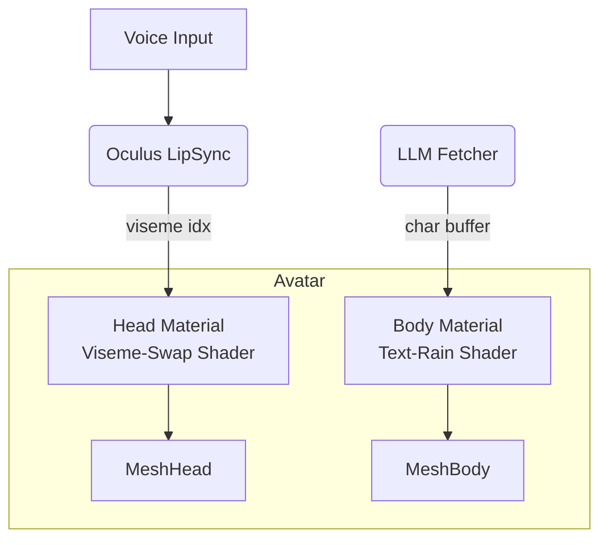

# LLM-Driven Text-Shader Avatar

A modular blueprint for an avatar whose face lip-syncs with viseme textures while the body displays constantly evolving LLM-generated text.

---
## 0  Component Map


---
## 1  Assets
| File | Purpose | Notes |
|------|---------|-------|
| `Viseme_00.png … Viseme_14.png` | 15 mouth textures | RGBA, shared UV layout |
| `text_atlas.png` | Grid of 96 printable ASCII glyphs | R8, 12 × 8 grid |
| `body_mask.png` | Alpha mask in UV space | white = show text |
| (optional) `intro/outro_48k.mp4` | Re-encoded to 48 kHz audio | avoids buffer overflows |

---
## 2  Shaders
### 2.1 Head – Viseme Swap
**Material properties**
```
_TextureArray  (VisemeTexArr)
_Int           (_VisemeIdx)
```
Fragment snippet
```hlsl
fixed4 col = VisemeTexArr.Sample(samplerVisemeTexArr,
                                 float3(IN.uv, _VisemeIdx));
return col;
```

### 2.2 Body – Text Rain
Uniforms
```
StructuredBuffer<uint> _Chars  // rolling ASCII codes
int                    _CharCount
float                  _Time
sampler2D              _Atlas
sampler2D              _Mask
```
Pseudo fragment
```hlsl
float2 uv = IN.uv;
uv.y = frac(uv.y + _Time * 0.2);           // scroll
int col = (int)(uv.x * 80);
int row = (int)(uv.y * 40);
uint idx = _Chars[(row * 80 + col) % _CharCount];

float2 gUV = float2((idx % 12 + frac(uv.x*80))/12.0,
                    (idx / 12 + frac(uv.y*40))/8.0);
float glyph = tex2D(_Atlas, gUV).r;
float mask  = tex2D(_Mask, IN.uv).r;
return float4(glyph, glyph, glyph, glyph) * mask;
```

---
## 3  Runtime Scripts
### 3.1 LLM Text Buffer Updater
```csharp
public class TextBufferUpdater : MonoBehaviour
{
    [SerializeField] ComputeBuffer gpuBuffer;
    async void Start()
    {
        while (true)
        {
            string raw = await GetLLMTextAsync();
            raw = Regex.Replace(raw, "[^ -~]", "");       // ASCII only
            raw = raw.PadRight(2048, ' ');
            uint[] codes = raw.Select(c => (uint)c).ToArray();
            gpuBuffer.SetData(codes);
            await Task.Delay(2000);
        }
    }
}
```

### 3.2 Viseme Driver
```csharp
void OnVisemeFrame(OvrLipSync.Frame f)
{
    int idx = f.Visemes.Select((v,i)=>new{v,i})
                       .OrderByDescending(x=>x.v)
                       .First().i;
    headMat.SetInt("_VisemeIdx", idx);
}
```

---
## 4  Scene Setup Checklist
1. Avatar mesh split into `Head` and `Body` sub-meshes.  
2. **Head** material → Viseme-Swap shader with `Texture2DArray` of 15 textures.  
3. **Body** material → Text Rain shader with atlas + mask.  
4. Attach `OvrLipSyncContext` to microphone input.  
5. Add `TextBufferUpdater` (singleton) + give it the GPU buffer reference.  
6. Verify URP/HDRP pipeline asset supports compute buffers.

---
## 5  Performance Tips
* Upload new text to GPU once every few seconds, not per frame.  
* Keep the atlas in single-channel R8 texture to reduce bandwidth.  
* Use instancing if multiple avatars share the same body material.

---
## 6  Stretch Goals
* Sentiment analysis → body text tint (HSV).  
* BPM-sync scroll speed.  
* Replace ASCII with emoji glyph atlas.  
* Allow audience chat to override the LLM buffer live. 