# AIShow System Documentation - Complete Guide

> **Comprehensive visual documentation of the Unity-based AI podcast generation system supporting 30+ languages**

---

## Table of Contents

1. [System Overview](#system-overview)
2. [Episode Recording Pipeline](#episode-recording-pipeline)
3. [Batch Processing Workflow](#batch-processing-workflow)
4. [ShowRunner Core Components](#showrunner-core-components)
5. [Quick Reference](#quick-reference)

---

## System Overview

### High-Level Architecture

```mermaid
graph TD
    %% High-Level System Architecture
    
    %% Input Layer
    JSON[/"Episode JSON<br/>Configuration"/] 
    CLI[/"CLI Commands<br/>Batch Processing"/]
    UI[/"Unity UI<br/>Manual Control"/]
    
    %% Core System Layer
    ShowRunner["🎭 ShowRunner<br/>Central Controller"]
    BatchRecorder["📹 BatchRecorder<br/>Multi-Episode Manager"]
    ShowRecorder["🎬 ShowRecorder<br/>Video Capture"]
    
    %% Processing Layer
    EventProcessor["⚡ EventProcessor<br/>Scene Events"]
    SceneManager["🎬 Scene Manager<br/>Transitions & Prep"]
    AudioManager["🔊 Audio Manager<br/>TTS & Music"]
    
    %% Generation Layer  
    ShowrunnerManager["🤖 ShowrunnerManager<br/>LLM Content Generation"]
    ElevenLabs["🗣️ ElevenLabs API<br/>Text-to-Speech"]
    
    %% Output Layer
    MetadataFixer["📝 MetadataFixer<br/>File Path Updates"]
    EpisodeArchiver["📦 EpisodeArchiver<br/>ZIP Creation"]
    VideoOutput[/"MP4 Videos<br/>Multiple Languages"/]
    Archives[/"Episode Archives<br/>Complete Packages"/]
    
    %% Connections - Input to Core
    JSON --> ShowRunner
    CLI --> BatchRecorder
    UI --> ShowRunner
    CLI --> ShowrunnerManager
    
    %% Core System Connections
    ShowRunner --> EventProcessor
    ShowRunner --> SceneManager
    ShowRunner --> AudioManager
    BatchRecorder --> ShowRunner
    BatchRecorder --> ShowRecorder
    ShowRunner --> ShowRecorder
    
    %% Generation Pipeline
    ShowrunnerManager --> ElevenLabs
    ShowrunnerManager --> JSON
    ElevenLabs --> AudioManager
    
    %% Recording & Output Pipeline
    ShowRecorder --> VideoOutput
    ShowRecorder --> MetadataFixer
    MetadataFixer --> EpisodeArchiver
    EpisodeArchiver --> Archives
    
    %% Processing Flow
    EventProcessor --> SceneManager
    SceneManager --> AudioManager
    
    %% Style Classes
    classDef inputClass fill:#e1f5fe,stroke:#01579b,stroke-width:2px
    classDef coreClass fill:#f3e5f5,stroke:#4a148c,stroke-width:2px  
    classDef processClass fill:#fff3e0,stroke:#e65100,stroke-width:2px
    classDef outputClass fill:#e8f5e8,stroke:#1b5e20,stroke-width:2px
    classDef apiClass fill:#fce4ec,stroke:#880e4f,stroke-width:2px
    
    %% Apply Styles
    class JSON,CLI,UI inputClass
    class ShowRunner,BatchRecorder,ShowRecorder coreClass
    class EventProcessor,SceneManager,AudioManager,MetadataFixer processClass
    class VideoOutput,Archives outputClass
    class ShowrunnerManager,ElevenLabs apiClass
```



### System Components

#### Input Layer (🟦 Blue)
- **Episode JSON**: Configuration files defining show content, scenes, and dialogue
- **CLI Commands**: Batch processing commands for automated content generation
- **Unity UI**: Manual interface for single-episode recording and testing

#### Core System Layer (🟪 Purple)
- **ShowRunner**: Central orchestrator managing episode playback and scene flow
- **BatchRecorder**: Manages sequential recording of multiple language variants
- **ShowRecorder**: Handles video capture, encoding, and file output

#### Processing Layer (🟨 Orange)
- **EventProcessor**: Handles scene events, dialogue triggers, and transitions
- **Scene Manager**: Manages Unity scene preparation and transitions  
- **Audio Manager**: Controls TTS playback, background music, and audio mixing
- **MetadataFixer**: Updates file paths and metadata after recording completes

#### Generation Layer (🟥 Pink)
- **ShowrunnerManager**: Interfaces with LLMs for content generation
- **ElevenLabs API**: Converts text to speech in multiple languages

#### Output Layer (🟩 Green)
- **MP4 Videos**: Rendered episode videos in multiple languages
- **Episode Archives**: Complete ZIP packages containing all episode assets

### Key Data Flows

1. **Content Generation**: CLI → ShowrunnerManager → ElevenLabs → Audio Files
2. **Manual Recording**: UI → ShowRunner → ShowRecorder → Video Output
3. **Batch Processing**: CLI → BatchRecorder → (Multiple Episodes) → Archives
4. **Post-Processing**: ShowRecorder → MetadataFixer → EpisodeArchiver → Archives

---

## Episode Recording Pipeline

### Recording & Archiving Flow

```mermaid
graph TD
    %% Episode Recording & Archiving Pipeline
    
    %% Input
    Start([Start Recording])
    EpisodeJSON[/"📄 Episode JSON<br/>Configuration"/]
    
    %% Core Recording Flow
    LoadShow["🎭 ShowRunner<br/>LoadShowData()"]
    SelectEpisode["📺 ShowRunner<br/>SelectEpisode(0)"]
    PrepareScene["🎬 Scene Manager<br/>PrepareScene()"]
    
    %% Playback Loop
    PlayEpisode["▶️ Episode Playback<br/>Auto/Manual Mode"]
    ProcessEvents["⚡ EventProcessor<br/>Handle speak/scene events"]
    SceneTransitions["🔄 Scene Transitions<br/>Intro → Content → Outro"]
    
    %% Recording System
    StartRecording["🎬 ShowRecorder<br/>StartRecording()"]
    CaptureVideo["📹 Video Capture<br/>MP4 Encoding"]
    StopRecording["⏹️ ShowRecorder<br/>StopRecording()"]
    
    %% Post-Processing Pipeline
    WriteSidecar["📝 Write Sidecar<br/>SMPTE Timecode Data"]
    TriggerExit["🚪 Trigger Exit<br/>OnAboutToExitUnity()"]
    
    %% Metadata & Archiving (Sequential Steps)
    MetadataFix["📝 MetadataFixer<br/>Update File Paths"]
    WaitComplete["⏳ Wait for<br/>Metadata Completion"]
    
    ArchiveStart["📦 Start Archiving<br/>EpisodeArchiver.ArchiveEpisodeAsync()"]
    CreateZip["🗜️ Create ZIP<br/>ZipFile.CreateFromDirectory()"]
    VerifyArchive["✅ Verify Archive<br/>Size & Completion Check"]
    ArchiveComplete["📦 Archive Complete<br/>Callback Confirmation"]
    
    %% Final Exit Sequence
    EmergencyThread["🛡️ Emergency Thread<br/>15-second timeout"]
    UnityExit["🚪 Unity Exit<br/>EditorApplication.Exit(0)"]
    
    %% Output
    VideoFile[/"🎥 MP4 Video<br/>episodeId_lang_timestamp.mp4"/]
    SidecarFile[/"📄 Sidecar JSON<br/>SMPTE Event Data"/]
    ArchiveFile[/"📦 Episode Archive<br/>episodeId_timestamp.zip"/]
    
    %% Flow Connections
    Start --> EpisodeJSON
    EpisodeJSON --> LoadShow
    LoadShow --> SelectEpisode
    SelectEpisode --> PrepareScene
    PrepareScene --> StartRecording
    StartRecording --> PlayEpisode
    
    %% Playback Loop
    PlayEpisode --> ProcessEvents
    ProcessEvents --> SceneTransitions
    SceneTransitions --> CaptureVideo
    CaptureVideo --> PlayEpisode
    
    %% Episode Completion
    SceneTransitions --> StopRecording
    StopRecording --> WriteSidecar
    WriteSidecar --> VideoFile
    WriteSidecar --> SidecarFile
    WriteSidecar --> TriggerExit
    
    %% Post-Processing Sequence
    TriggerExit --> MetadataFix
    MetadataFix --> WaitComplete
    WaitComplete --> ArchiveStart
    ArchiveStart --> CreateZip
    CreateZip --> VerifyArchive  
    VerifyArchive --> ArchiveComplete
    ArchiveComplete --> ArchiveFile
    
    %% Exit Management
    ArchiveComplete --> EmergencyThread
    EmergencyThread --> UnityExit
    
    %% Decision Points
    PlayEpisode -.->|Episode Complete| StopRecording
    
    %% Style Classes
    classDef startEnd fill:#c8e6c9,stroke:#2e7d32,stroke-width:3px
    classDef coreProcess fill:#e3f2fd,stroke:#1565c0,stroke-width:2px
    classDef recording fill:#fff3e0,stroke:#ef6c00,stroke-width:2px
    classDef postProcess fill:#f3e5f5,stroke:#7b1fa2,stroke-width:2px
    classDef output fill:#e8f5e8,stroke:#388e3c,stroke-width:2px
    classDef safety fill:#ffebee,stroke:#c62828,stroke-width:2px
    
    %% Apply Styles  
    class Start,UnityExit startEnd
    class LoadShow,SelectEpisode,PrepareScene,PlayEpisode,ProcessEvents,SceneTransitions coreProcess
    class StartRecording,CaptureVideo,StopRecording,WriteSidecar recording
    class MetadataFix,WaitComplete,ArchiveStart,CreateZip,VerifyArchive,ArchiveComplete postProcess
    class VideoFile,SidecarFile,ArchiveFile output
    class TriggerExit,EmergencyThread safety
```



### Pipeline Stages

#### 1. Episode Initialization (🟩 Green)
- Load episode JSON configuration
- Select first episode (index 0) for recording
- Prepare Unity scene for recording

#### 2. Recording Setup (🟨 Orange)  
- Initialize Unity's RecorderController
- Configure video encoding (MP4, 1920x1080, 30fps)
- Set up audio capture and sidecar event logging

#### 3. Episode Playback (🟦 Blue)
- Execute episode in auto or manual mode
- Process speak events and scene transitions
- Handle intro → content → outro sequence
- Capture video frames and audio continuously

#### 4. Post-Recording Processing (🟪 Purple)
**Sequential steps that must complete in order**:

- **Immediate Cleanup**: Stop recording, write sidecar JSON
- **Metadata Fixing**: Update JSON files with correct file paths
- **Episode Archiving**: Create ZIP archive of entire episode folder
- **Verification**: Confirm all operations completed successfully

#### 5. Safe Exit Sequence (🟥 Red)
- Start 15-second emergency timeout thread
- Attempt graceful Unity exit
- Force termination if Unity hangs during cleanup

### File Organization
```
Episodes/
└── episodeId/
    ├── recordings/
    │   ├── episodeId_lang_timestamp.mp4
    │   └── episodeId_lang_timestamp.json
    ├── metadata/
    │   └── *_youtube_metadata*.json
    ├── audio/
    │   └── lang/
    └── thumbnail/

EpisodeArchives/
└── episodeId_timestamp.zip
```

---

## Batch Processing Workflow

### Multi-Language Automation

```mermaid
graph TD
    %% Batch Processing Workflow
    
    %% CLI Entry Points
    Start([CLI Command])
    GenerateOnly["🤖 Generate Only<br/>-generate flag"]
    RecordOnly["📹 Record Only<br/>-record -batchEpisodeId"]
    GenerateAndRecord["🔄 Generate + Record<br/>Both flags"]
    
    %% Content Generation Phase
    ShowrunnerManager["🤖 ShowrunnerManager<br/>LLM Content Generation"]
    LLMCall["💭 LLM API Call<br/>Create Episode Content"]
    Translation["🌍 Translation<br/>30+ Languages"]
    TTSGeneration["🗣️ ElevenLabs TTS<br/>Multi-Language Audio"]
    
    %% Episode Discovery & Queue
    DiscoverEpisodes["🔍 Discover Episodes<br/>Find Language Variants"]
    CreateQueue["📋 Create Episode Queue<br/>en, ko, ch, es..."]
    
    %% Batch Recording Loop
    BatchStart["🎬 BatchRecorder<br/>StartBatchRecording()"]
    DequeueEpisode["📤 Dequeue Next<br/>Load Episode Data"]
    RecordEpisode["🎥 Record Single Episode<br/>(See Episode Pipeline)"]
    
    %% Post-Episode Processing
    EpisodeComplete["✅ Episode Complete<br/>OnOutroVideoAndFadeComplete"]
    CheckQueue{"📋 More Episodes<br/>in Queue?"}
    ProcessNext["⏭️ Process Next<br/>Episode in Queue"]
    
    %% Batch Completion
    BatchComplete["🏁 Batch Complete<br/>All Languages Done"]
    MetadataFixAll["📝 Fix All Metadata<br/>Update File Paths"]
    ArchiveAll["📦 Archive Episodes<br/>Create ZIP Packages"]
    
    %% Output
    MultiLanguageVideos[/"🎥 Multi-Language Videos<br/>episode_en.mp4, episode_ko.mp4..."/]
    CompleteArchives[/"📦 Complete Archives<br/>episode_timestamp.zip"/]
    
    %% CLI Decision Flow
    Start --> GenerateOnly
    Start --> RecordOnly
    Start --> GenerateAndRecord
    
    %% Generation Path
    GenerateOnly --> ShowrunnerManager
    GenerateAndRecord --> ShowrunnerManager
    ShowrunnerManager --> LLMCall
    LLMCall --> Translation
    Translation --> TTSGeneration
    
    %% Recording Path
    RecordOnly --> DiscoverEpisodes
    TTSGeneration --> DiscoverEpisodes
    DiscoverEpisodes --> CreateQueue
    CreateQueue --> BatchStart
    
    %% Batch Loop
    BatchStart --> DequeueEpisode
    DequeueEpisode --> RecordEpisode
    RecordEpisode --> EpisodeComplete
    EpisodeComplete --> CheckQueue
    CheckQueue -->|Yes| ProcessNext
    ProcessNext --> DequeueEpisode
    CheckQueue -->|No| BatchComplete
    
    %% Final Processing
    BatchComplete --> MetadataFixAll
    MetadataFixAll --> ArchiveAll
    RecordEpisode --> MultiLanguageVideos
    ArchiveAll --> CompleteArchives
    
    %% Styles
    classDef cliEntry fill:#e8f5e8,stroke:#2e7d32,stroke-width:3px
    classDef generation fill:#fff3e0,stroke:#f57c00,stroke-width:2px
    classDef batchProcess fill:#e3f2fd,stroke:#1976d2,stroke-width:2px
    classDef recording fill:#f3e5f5,stroke:#7b1fa2,stroke-width:2px
    classDef output fill:#e0f2f1,stroke:#00695c,stroke-width:2px
    classDef decision fill:#fff8e1,stroke:#f9a825,stroke-width:2px
    
    class Start,GenerateOnly,RecordOnly,GenerateAndRecord cliEntry
    class ShowrunnerManager,LLMCall,Translation,TTSGeneration generation
    class DiscoverEpisodes,CreateQueue,BatchStart,DequeueEpisode,ProcessNext batchProcess
    class RecordEpisode,EpisodeComplete,BatchComplete,MetadataFixAll,ArchiveAll recording
    class MultiLanguageVideos,CompleteArchives output
    class CheckQueue decision
```



### CLI Entry Points

#### Generate Only
```bash
Unity.exe -executeMethod ShowRunner.CLI.EpisodeProcessorCLI.GenerateAndRecordBatchFromCommandLine -generate
```
- Creates episode content via LLM
- Generates multi-language translations  
- Produces TTS audio files
- Exits after generation

#### Record Only
```bash
Unity.exe -executeMethod ShowRunner.CLI.EpisodeProcessorCLI.ProcessBatchFromCommandLine -batchEpisodeId "S1E86"
```
- Records existing episodes in all languages
- Requires pre-generated content
- Produces video files and archives

#### Generate + Record
```bash
Unity.exe -executeMethod ShowRunner.CLI.EpisodeProcessorCLI.GenerateAndRecordBatchFromCommandLine -generate -record
```
- Full pipeline from content creation to video archives
- Most common production workflow

### Multi-Language Processing

The system processes languages in alphabetical order:
1. **English (en)** - Base language
2. **Chinese (ch)** - Simplified Chinese
3. **Korean (ko)** - Korean  
4. **Spanish (es)** - Spanish
5. *...additional languages as configured*

### Performance Characteristics

- **Content Generation**: 5-10 minutes per episode
- **TTS Generation**: 2-3 minutes per language
- **Video Recording**: 3-5 minutes per language
- **Total Time**: 45-60 minutes for full 10-language batch

---

## ShowRunner Core Components

### Component Architecture

```mermaid
graph TD
    %% ShowRunner Core System Components
    
    %% Main Controller
    ShowRunner["🎭 ShowRunner<br/>Central Controller"]
    
    %% Data Management
    ShowData["📄 ShowData<br/>Episode/Scene/Dialogue"]
    EpisodeData["📺 Episode Data<br/>Current Episode State"]
    
    %% UI Components
    ShowRunnerUI["🖥️ ShowRunnerUI<br/>Control Interface"]
    UIContainer["📱 UIContainer<br/>UI Element Management"]
    UXAnimationManager["✨ UXAnimationManager<br/>UI Animations"]
    
    %% Core Managers
    EventProcessor["⚡ EventProcessor<br/>Event Handling"]
    SceneTransitionManager["🔄 SceneTransitionManager<br/>Scene Switching"]
    ScenePreparationManager["🎬 ScenePreparationManager<br/>Scene Setup"]
    
    %% Audio System
    BackgroundMusicManager["🎵 BackgroundMusicManager<br/>Music Control"]
    ActorAudioSourceAssigner["🗣️ ActorAudioSourceAssigner<br/>Voice Assignment"]
    
    %% Media Management
    CommercialManager["📺 CommercialManager<br/>Ad Playback"]
    ScreenshotManager["📸 ScreenshotManager<br/>Image Capture"]
    
    %% State Management
    ShowState{"🔄 Show State<br/>Loading/Playing/Paused"}
    ManualMode{"🎮 Mode<br/>Manual/Auto"}
    
    %% External Integrations
    UnityScene["🎯 Unity Scene<br/>3D Environment"]
    VideoPlayer["🎬 Video Player<br/>Commercial Playback"]
    
    %% Core Relationships
    ShowRunner --> ShowData
    ShowRunner --> EpisodeData
    ShowRunner --> EventProcessor
    ShowRunner --> SceneTransitionManager
    ShowRunner --> ScenePreparationManager
    
    %% UI Relationships
    ShowRunnerUI --> ShowRunner
    UIContainer --> ShowRunnerUI
    UXAnimationManager --> UIContainer
    
    %% Manager Relationships
    EventProcessor --> SceneTransitionManager
    SceneTransitionManager --> ScenePreparationManager
    ScenePreparationManager --> UnityScene
    
    %% Audio Relationships
    ShowRunner --> BackgroundMusicManager
    ShowRunner --> ActorAudioSourceAssigner
    EventProcessor --> ActorAudioSourceAssigner
    
    %% Media Relationships
    ShowRunner --> CommercialManager
    CommercialManager --> VideoPlayer
    ShowRunner --> ScreenshotManager
    
    %% State Relationships
    ShowRunner --> ShowState
    ShowRunner --> ManualMode
    ShowRunnerUI --> ManualMode
    
    %% Event Flow
    EventProcessor -.->|speak events| ActorAudioSourceAssigner
    EventProcessor -.->|scene events| SceneTransitionManager
    EventProcessor -.->|screenshot events| ScreenshotManager
    
    %% UI Control Flow
    ShowRunnerUI -.->|Play/Pause| ShowRunner
    ShowRunnerUI -.->|Next Step| ShowRunner
    ShowRunnerUI -.->|Episode Select| ShowRunner
    
    %% State Notifications
    ShowState -.->|state change| UXAnimationManager
    CommercialManager -.->|pause/resume| ShowRunner
    
    %% Styles
    classDef controller fill:#e3f2fd,stroke:#1565c0,stroke-width:3px
    classDef data fill:#e8f5e8,stroke:#2e7d32,stroke-width:2px
    classDef ui fill:#fff3e0,stroke:#ef6c00,stroke-width:2px
    classDef manager fill:#f3e5f5,stroke:#7b1fa2,stroke-width:2px
    classDef audio fill:#fff8e1,stroke:#f9a825,stroke-width:2px
    classDef media fill:#fce4ec,stroke:#ad1457,stroke-width:2px
    classDef state fill:#e0f2f1,stroke:#00695c,stroke-width:2px
    classDef external fill:#efebe9,stroke:#5d4037,stroke-width:2px
    
    class ShowRunner controller
    class ShowData,EpisodeData data
    class ShowRunnerUI,UIContainer,UXAnimationManager ui
    class EventProcessor,SceneTransitionManager,ScenePreparationManager manager
    class BackgroundMusicManager,ActorAudioSourceAssigner audio
    class CommercialManager,ScreenshotManager media
    class ShowState,ManualMode state
    class UnityScene,VideoPlayer external
```



### Core System Functions

#### ShowRunner (Central Controller)
- **Episode Management**: Load, select, and control episode playback
- **State Coordination**: Manage system state across all components
- **Event Orchestration**: Coordinate responses to user and system events
- **Scene Flow**: Control transitions between intro, content, and outro

#### Event Processing System
- **Event Handling**: Process speak, scene, and system events
- **Scene Coordination**: Trigger scene transitions and preparations
- **Audio Coordination**: Route audio events to appropriate managers

#### UI System
- **User Interface**: Provide manual control interface
- **Animation Management**: Handle UI state changes and animations
- **Mode Control**: Switch between manual and automatic operation modes

#### Audio Management
- **Background Music**: Control ambient and transition music
- **Voice Assignment**: Route character dialogue to appropriate audio sources
- **Audio Mixing**: Coordinate TTS, music, and sound effects

#### Media Systems
- **Commercial Playback**: Handle video advertisement integration
- **Screenshot Capture**: Automated and event-driven image capture
- **Video Recording**: Integration with recording pipeline

---

## Quick Reference

### System Capabilities

#### Multi-Language Support
- **30+ Languages**: Automated content generation and recording
- **TTS Integration**: ElevenLabs API for high-quality voice synthesis
- **Cultural Adaptation**: Language-specific content and presentation

#### Automation Features
- **Batch Processing**: Unattended multi-episode generation
- **Error Recovery**: Robust handling of failures and edge cases
- **Archive Creation**: Automatic packaging for distribution
- **Metadata Management**: File path and duration updates

#### Recording Features
- **High Quality**: 1920x1080 @ 30fps H.264 encoding
- **SMPTE Timecode**: Professional broadcast-standard timing
- **Sidecar Data**: Detailed event logging for post-processing
- **Audio Capture**: Synchronized voice and music recording

### Common Use Cases

#### Content Creator Workflow
1. **Generate Content**: Use CLI to create episode content
2. **Review & Edit**: Manual review of generated scripts
3. **Batch Record**: Automated recording in all languages
4. **Distribute**: Upload archived episodes to platforms

#### Developer Workflow  
1. **Test Changes**: Manual recording via Unity UI
2. **Validate Pipeline**: Single-language test recordings
3. **Integration Testing**: Full batch processing tests
4. **Performance Monitoring**: Resource usage and timing analysis

#### Production Pipeline
1. **Content Planning**: Episode topic and structure planning
2. **Automated Generation**: LLM-driven content creation
3. **Quality Assurance**: Automated verification and validation
4. **Distribution**: Multi-platform publishing workflow

### File Structure Overview
```
aishow/
├── Assets/Scripts/
│   ├── ShowRunner/          # Core show management
│   ├── Automation/          # Batch processing
│   ├── CLI/                 # Command-line interface
│   └── Utilities/           # Recording & archiving
├── Episodes/                # Episode content
│   └── episodeId/
│       ├── recordings/      # Video outputs
│       ├── metadata/        # YouTube metadata
│       ├── audio/           # TTS audio files
│       └── thumbnail/       # Episode thumbnails
└── EpisodeArchives/         # Complete episode packages
```

### Key Configuration Files
- **Language Config**: Supported languages and TTS voices
- **Recording Settings**: Video quality and encoding options
- **Batch Processing**: Episode discovery and queue management
- **API Integration**: LLM and TTS service configuration

---

## System Status

**Current Version**: December 2024
**Unity Version**: 2022.3 LTS
**Platform Support**: Windows, macOS, Linux (headless)
**Language Support**: 30+ languages via ElevenLabs API
**Recording Format**: MP4 H.264 with AAC audio
**Archive Format**: ZIP compression with metadata

**Recent Major Features**:
- ✅ Episode archiving system with robust Unity exit handling
- ✅ Multi-language batch processing automation  
- ✅ Emergency exit thread preventing Unity hanging
- ✅ Comprehensive CLI interface for production workflows
- ✅ SMPTE timecode generation for professional integration

---

*This documentation represents the current AIShow system architecture as of December 2024. The system is actively developed and these diagrams are maintained to reflect the actual implementation.* 